# 🛡️ SOC Security Dashboard — Splunk

> A SOC-style dashboard built in Splunk to monitor authentication events, detect brute-force attempts, analyze system errors, and visualize suspicious activity patterns using indexed log data.

---

## 📌 Project Overview

This project simulates a real-world Security Operations Center (SOC) workflow using Splunk Enterprise. Log data was ingested, parsed, and queried using SPL (Search Processing Language) to identify attack patterns, failed logins, and brute-force attempts — then visualized across a multi-panel custom Splunk dashboard.

| Detail | Value |
|---|---|
| Environment | Kali Linux — Splunk Enterprise 10.2.2 |
| Index | main |
| Log Sources | sample_splunk_logs.log, sample.log (custom_log sourcetype) |
| Total Events Indexed | 31 |
| Dashboard Export Date | 2026-04-10 23:37:02 IST |

---

## 🎯 Objectives

- Ingest and index authentication log data into Splunk
- Write SPL queries to detect failed logins, brute-force patterns, and suspicious activity
- Build a multi-panel SOC dashboard covering event volume, authentication failures, IP analysis, and brute-force detection
- Simulate real SOC analyst workflow: event triage → severity classification → IP-based correlation → visualization

---

## 🗂️ Log Sources

| File | Sourcetype | Events | Notes |
|---|---|---|---|
| sample_splunk_logs.log | Splunk sample logs | 15 | Structured auth events — ERRORs, WARNINGs, INFO |
| sample.log | custom_log | 16 | Multi-line events capturing login sequences |

---

## 🔍 Phase 1 — Log Ingestion & Initial Search

All events were ingested into the main index and verified via index=main query across all time.

*SPL:*
spl
index=main

*Result: 31 events confirmed across both log sources.*

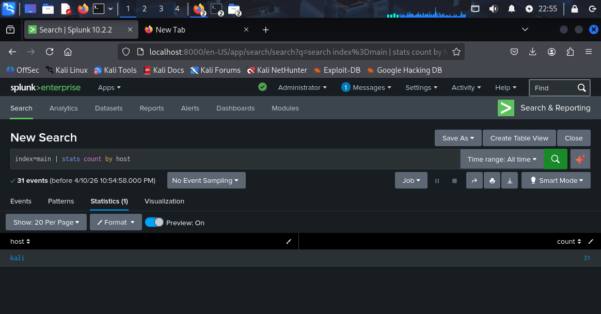

---

## 🔍 Phase 2 — Source-Specific Log Verification

Each log source was queried individually to confirm correct ingestion and sourcetype assignment.

*SPL:*
spl
source="sample_splunk_logs.log" host="kali" index="main" sourcetype="Splunk sample logs"

*Result: 15 structured authentication events confirmed.*

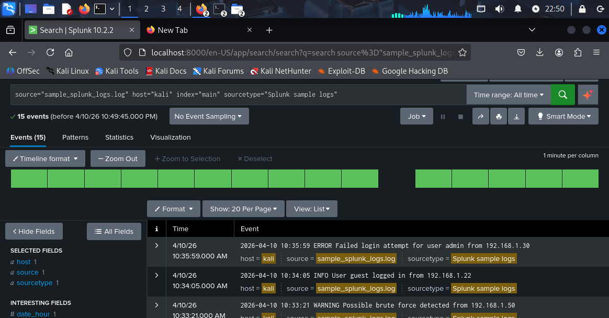

---

## 🔍 Phase 3 — Failed Login Detection

Targeted detection of all failed login events across both log sources.

*SPL:*
spl
index=main "Failed login"

*Result: 13 failed login events identified across users admin, root, and test.*

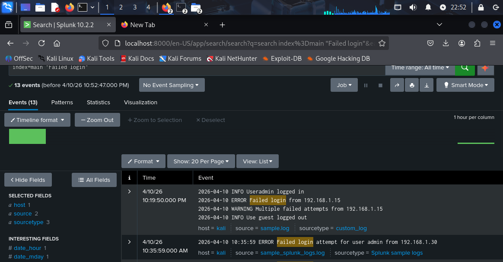

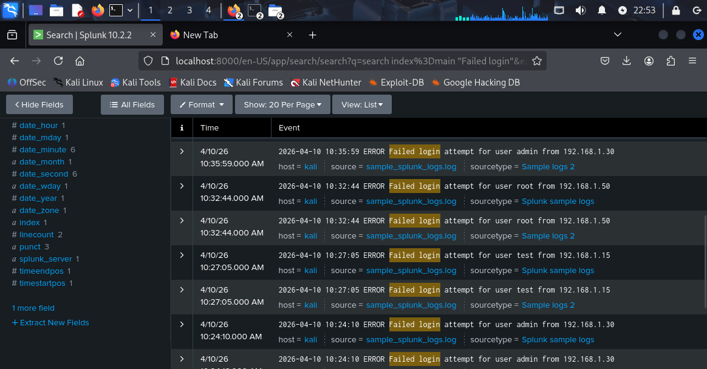

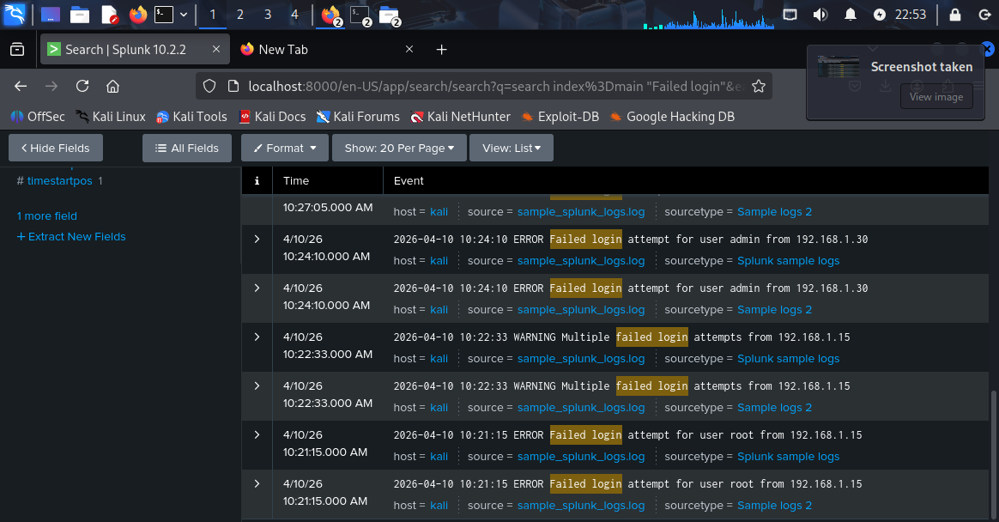

---

## 🔍 Phase 4 — Failed Login Count by Host

Aggregated failed login count per host to identify the primary source of authentication failures.

*SPL:*
spl
index=main "Failed login" | stats count by host

*Result: kali host — 1 aggregated count (single host environment).*

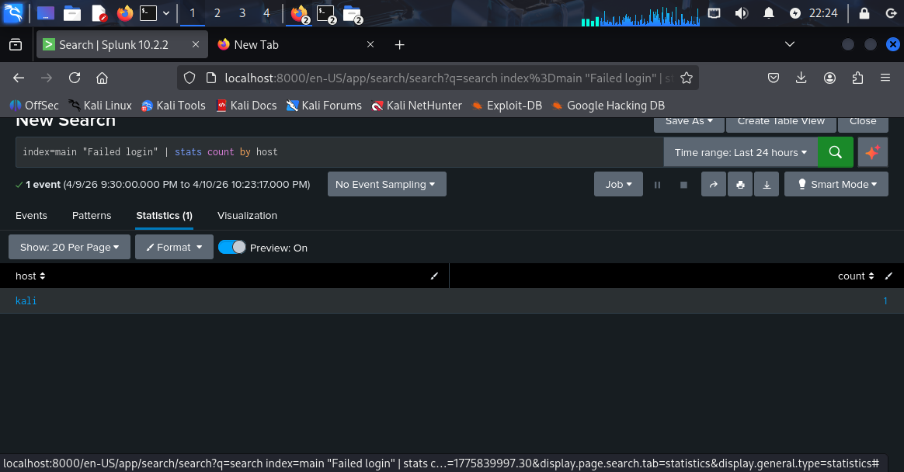

---

## 🔍 Phase 5 — ERROR & WARNING Event Detection

*ERROR events only:*
spl
index=main ERROR

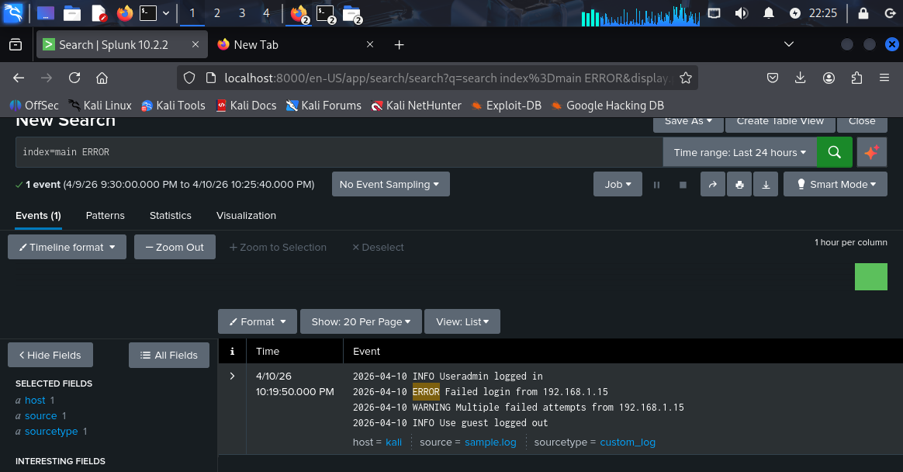

---

*WARNING events only:*
spl
index=main WARNING

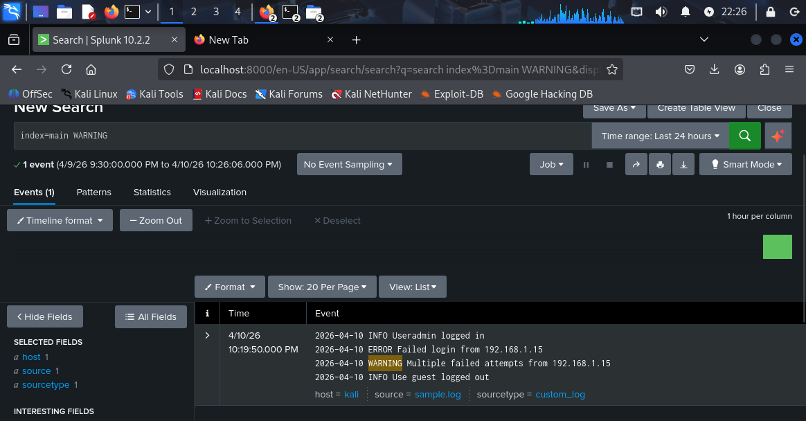

---

*Combined threat sweep:*
spl
index=main (ERROR OR WARNING)

*Result: 19 threat-level events identified.*

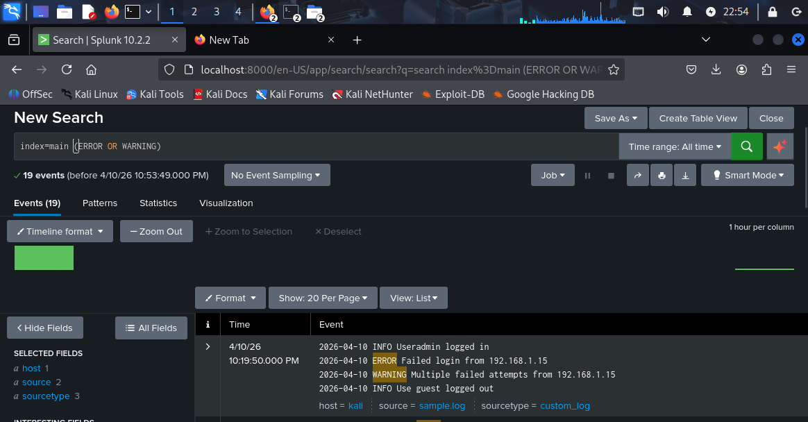

---

*Broad multi-keyword sweep:*
spl
index=main ("Failed" OR "ERROR" OR "WARNING")

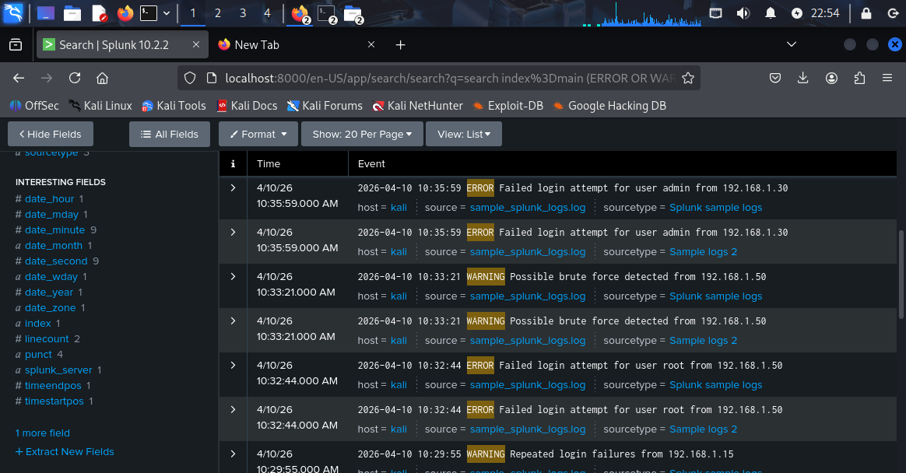

---

## 📊 Phase 6 — SOC Dashboard

A multi-panel SOC Security Dashboard was built in Splunk to visualize all findings in a single operational view.

### Dashboard Overview — System Event Volume

The top panel displays all indexed events in a table format — the full authentication timeline across both log sources.

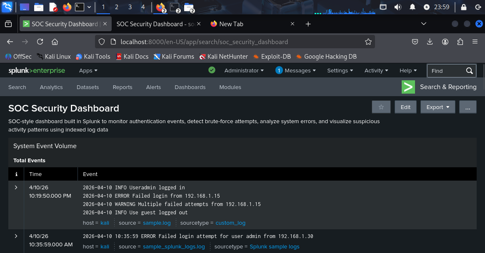

---

### Panel 2 — Authentication Failures

Targeted view of all failed login events with timestamps, usernames, and source IPs.

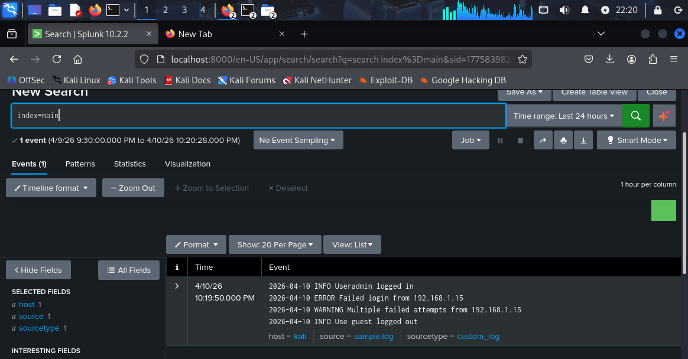

---

### Panel 3 — Suspicious Activity Signals (Errors & Warnings)

Timeline visualization of ERROR and WARNING events showing activity spike patterns across the monitored period.

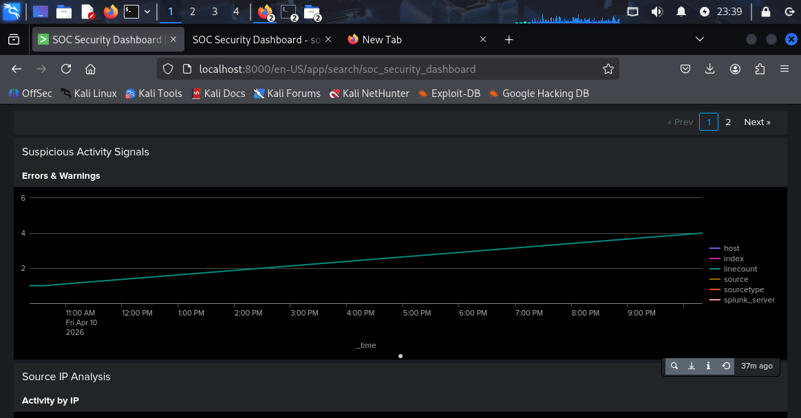

---

### Panel 4 — Source IP Analysis (Activity by IP)

Bar chart showing total event count per host. kali recorded ~31 events across the monitored window.

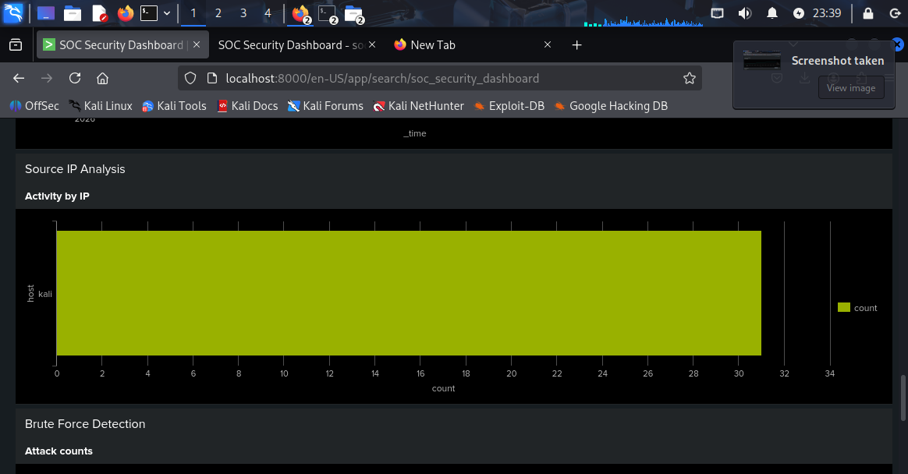

---

### Panel 5 — Brute Force Detection

Dedicated brute-force detection panel. ~12 brute-force-related events detected — triggered by Possible brute force detected and Multiple failed login attempts WARNING entries.

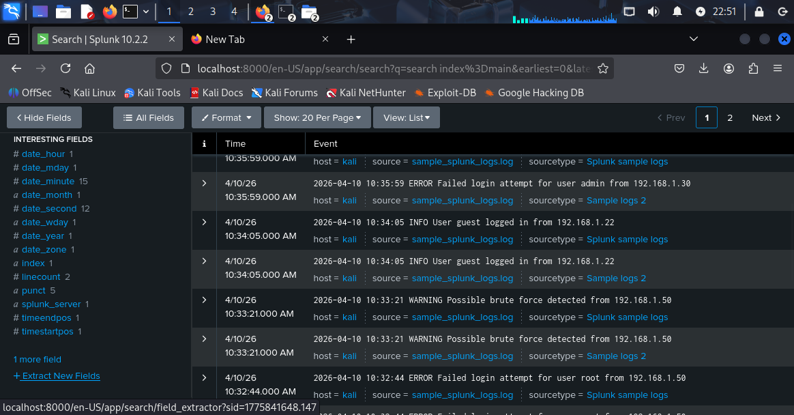

---

## 🚨 Key Events Detected

| Timestamp | Level | Event | Source IP |
|---|---|---|---|
| 10:35:59 | ERROR | Failed login — user admin | 192.168.1.30 |
| 10:33:21 | WARNING | Possible brute force detected | 192.168.1.50 |
| 10:32:44 | ERROR | Failed login — user root | 192.168.1.50 |
| 10:29:55 | WARNING | Repeated login failures | 192.168.1.15 |
| 10:27:05 | ERROR | Failed login — user test | 192.168.1.15 |
| 10:26:20 | WARNING | Suspicious activity detected | 192.168.1.30 |
| 10:24:10 | ERROR | Failed login — user admin | 192.168.1.30 |
| 10:22:33 | WARNING | Multiple failed login attempts | 192.168.1.15 |
| 10:21:15 | ERROR | Failed login — user root | 192.168.1.15 |
| 10:31:10 | INFO | User admin logged in (legitimate) | 192.168.1.10 |

*Attacker IPs:* 192.168.1.15, 192.168.1.50, 192.168.1.30
*Targeted Accounts:* admin, root, test, guest, support
*Legitimate Source:* 192.168.1.10 (successful admin logins)

---

## 📈 Severity Summary

| Host | Failed Logins | ERROR Events | WARNING Events | Severity |
|---|---|---|---|---|
| kali | 13 | ~10 | ~9 | *HIGH* |

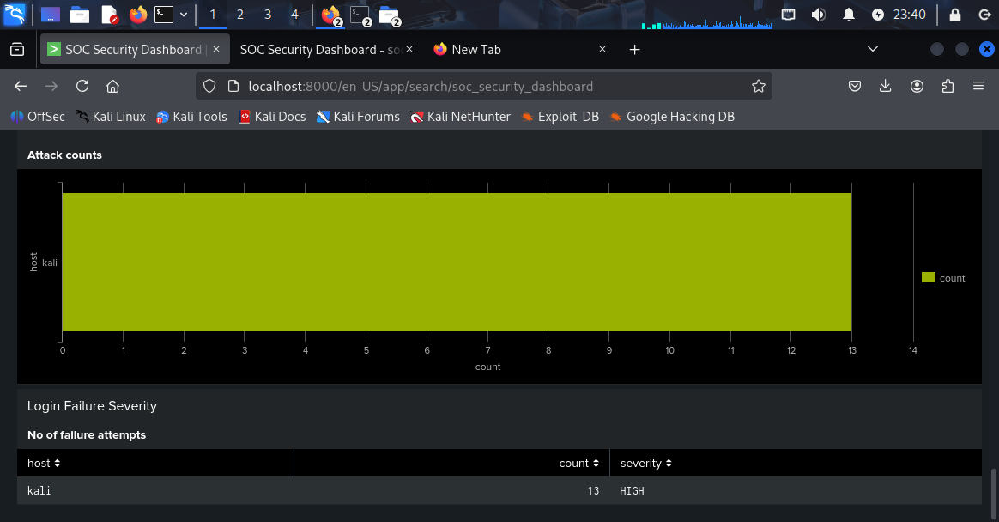
---

## 🔍 Full SPL Query Reference

| Query | Purpose |
|---|---|
| index=main | All events |
| source="sample_splunk_logs.log" host="kali" index="main" sourcetype="Splunk sample logs" | Source-specific |
| index=main "Failed login" | Failed login detection |
| index=main "Failed login" \| stats count by host | Failed login count by host |
| index=main ERROR | ERROR events only |
| index=main WARNING | WARNING events only |
| index=main (ERROR OR WARNING) | Combined threat events |
| index=main ("Failed" OR "ERROR" OR "WARNING") | Broad keyword sweep |

---

## 🧠 Skills Demonstrated

- Log ingestion and index configuration in Splunk Enterprise
- SPL query writing — field filtering, boolean operators, stats aggregation
- Brute-force and failed login detection from raw log data
- Multi-panel SOC dashboard creation — tables, bar charts, timeline visualizations
- Severity classification (HIGH) based on event correlation
- SOC analyst workflow: triage → filter → correlate → visualize → report

---

## 🛠️ Tools & Technologies

| Tool | Purpose |
|---|---|
| Splunk Enterprise 10.2.2 | Log ingestion, SPL querying, dashboard building |
| SPL (Search Processing Language) | Detection queries and aggregation |
| Kali Linux | Host environment |
| Custom log files | Simulated authentication event data |

---

## 📁 Repository Structure

Splunk-SOC_Security-Dashboard/
├── README.md
├── logs/
│   ├── sample_splunk_logs.log
│   └── sample.log
├── Splunk-SOC-Dashboard-Report.pdf
└── screenshots/
    ├── 01_all_events_31.png
    ├── 02_source_specific_query.png
    ├── 03_failed_login_13_events.png
    ├── 04_failed_login_detail.png
    ├── 05_failed_login_scroll.png
    ├── 06_failed_login_count_by_host.png
    ├── 07_error_events.png
    ├── 08_warning_events.png
    ├── 09_error_or_warning_19.png
    ├── 10_error_warning_detail.png
    ├── 11_broad_keyword_sweep.png
    ├── 12_dashboard_overview.png
    ├── 13_dashboard_auth_failures.png
    ├── 14_dashboard_suspicious_signals.png
    ├── 15_dashboard_ip_analysis.png
    └── 16_dashboard_brute_force.png

---

## ⚠️ Disclaimer

This project was conducted in a self-built, isolated lab environment using simulated log data for educational and portfolio purposes only. All activity was performed on systems I own and control.
